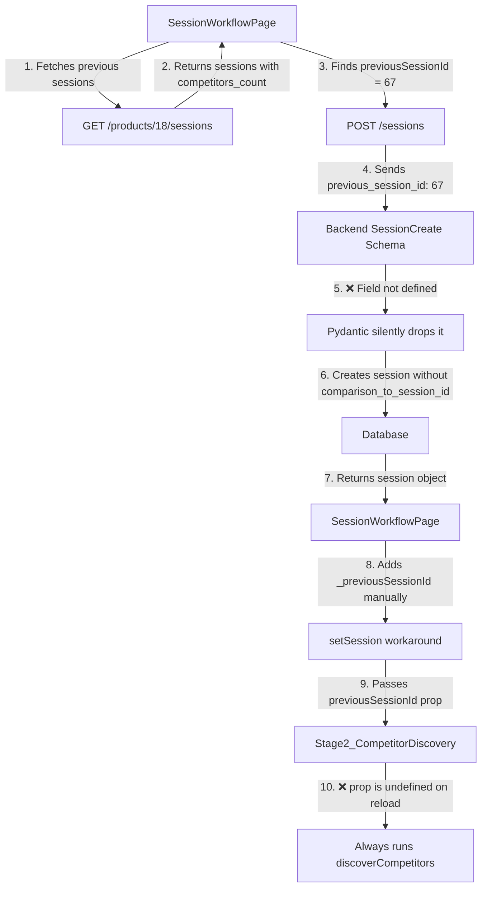

# Competitor Discovery & Feature Extraction Reuse Analysis

## Executive Summary

The competitor discovery and feature extraction reuse system is **partially implemented but broken**. The frontend correctly identifies previous sessions and attempts to pass the information to the backend, but **the backend schema, service, and API layers don't accept or return the `previous_session_id` field**, causing it to be silently dropped. As a result:

- ❌ Competitor discovery **re-runs every time** (30-60s delay even on repeat visits)
- ❌ Feature extraction **has no reuse logic** (always extracts fresh)
- ❌ "Choice UI" **exists but never triggers** (data doesn't flow correctly)
- ❌ **Data is lost on page reload** (relies on non-persistent `_previousSessionId` workaround)

**Good News:** All the database infrastructure exists. The UI is implemented. The fix requires **connecting 4 backend layers** and **adding Stage 3 reuse logic**.

---

## Problem Statement

### User Experience Issues

**Current Behavior:**
1. User selects product with previous competitor analysis
2. System fetches previous session ID ✓
3. System attempts to send it to backend ✗ (field not in schema)
4. Backend creates "full" analysis session (ignores previous)
5. Frontend manually stores `_previousSessionId` as workaround
6. Stage 2 always re-runs AI discovery (30-60s delay)
7. Stage 3 always re-extracts features (30-60s per competitor)

**Expected Behavior:**
1. User selects product with previous competitor analysis
2. System fetches previous session ID ✓
3. System sends to backend and stores in database ✓
4. Backend returns `comparison_to_session_id` in response ✓
5. Stage 2 shows "Use Existing" vs "Discover New" choice UI ✓
6. Stage 3 shows "Use Previous Features" vs "Re-extract" choice UI ✓
7. Defaults to most recent analysis (fast, no AI delay) ✓

---

## Root Cause Analysis

### The Broken Flow



### Four Missing Connections

#### 1. Backend Schema Missing Field

**File:** `backend/app/schemas/competitor_intelligence.py:71-80`

```python
class SessionCreate(BaseModel):
    product_id: Optional[int] = None
    # ... other fields ...
    enable_comparison: bool = Field(default=True)
    # ❌ MISSING: previous_session_id: Optional[int] = None
```

**Impact:** Frontend sends the field, but Pydantic validation strips it out silently.

---

#### 2. Session Service Doesn't Accept Parameter

**File:** `backend/app/services/session_service.py:30-114`

```python
def create_session(
    self,
    user_id: int,
    product_id: int,
    session_name: Optional[str] = None,
    enable_comparison: bool = True
    # ❌ MISSING: previous_session_id: Optional[int] = None
) -> CompetitorAnalysisSession:
```

**What It Does Now:**
- Lines 85-90: It internally checks for previous sessions based on `session_number > 1`
- Line 90: Sets `comparison_to_session_id` to the PREVIOUS session (by number)

**The Problem:**
- Always uses "previous by session_number" not "previous by user choice"
- User can't pick WHICH previous session to compare to
- Doesn't respect frontend's explicit `previous_session_id` parameter

**Example Scenario:**
```
Session 1: Had competitors A, B, C
Session 2: Had competitors A, B, D
Session 3: User wants to reuse Session 1 (not Session 2)
```

Currently IMPOSSIBLE - always compares to Session 2.

---

#### 3. API Endpoint Doesn't Extract or Pass Field

**File:** `backend/app/api/sessions.py:33-108`

```python
@router.post("", status_code=status.HTTP_201_CREATED)
def create_session(
    session_data: SessionCreate,
    # ...
):
    session = service.create_session(
        user_id=current_user.id,
        product_id=session_data.product_id,
        session_name=session_data.session_name,
        enable_comparison=session_data.enable_comparison
        # ❌ NOT PASSED: previous_session_id (even if schema had it)
    )
```

---

#### 4. API Response Doesn't Include comparison_to_session_id

**File:** `backend/app/api/sessions.py:143-153`

```python
return {
    "id": session.id,
    "session_number": session.session_number,
    # ... other fields ...
    # ❌ MISSING: "comparison_to_session_id": session.comparison_to_session_id
}
```

**Impact:** Even though the database HAS the field (it's set by service logic), the API doesn't return it, so frontend can't use it.

---

## Current State Analysis

### What Works ✅

1. **Database Schema** - Fully supports reuse:
   - `CompetitorAnalysisSession.comparison_to_session_id` exists (line 94)
   - `SessionCompetitor` table stores selected competitors
   - `ProductCompetitor` table persists competitors across sessions
   - `CompetitorFeature` tracks features with comparison support

2. **Frontend Fetching** - Correctly retrieves previous sessions:
   - `SessionWorkflowPage.jsx:70-89` fetches `/products/{id}/sessions`
   - Finds most recent session with `competitors_count > 0`
   - Stores `previousSessionId` correctly

3. **Stage 2 Choice UI** - Fully implemented:
   - Lines 234-342 render "Use Existing" vs "Discover New" options
   - Shows competitor preview
   - Has working handlers (`handleUseExisting`, `handleRediscover`)
   - Mentions 30-60s delay for rediscovery

4. **Stage 2 Logic** - Correct conditional flow:
   - `checkExistingCompetitors()` fetches from previous session
   - Filters for selected competitors
   - Sets `mode='choice'` to trigger UI

### What's Broken ❌

1. **Backend Schema** - Doesn't accept `previous_session_id` from frontend
2. **Session Service** - Uses automatic logic instead of explicit ID
3. **API Endpoint** - Doesn't extract or pass the field
4. **API Response** - Doesn't include `comparison_to_session_id`
5. **Frontend Workaround** - Uses non-persistent `_previousSessionId`
6. **Stage 3** - No reuse logic at all

### Why It Fails in Practice

**Scenario 1: Fresh Navigation**
```javascript
// SessionWorkflowPage.jsx line 92-99
const createResponse = await api.post('/competitor-intelligence/sessions', {
  product_id: 18,
  previous_session_id: 67  // ← Sent by frontend
});

// Backend receives it, but...
// 1. SessionCreate schema doesn't have the field
// 2. Pydantic drops it silently
// 3. Service creates session with comparison_to_session_id = NULL or auto-detected

// Frontend workaround (line 101-104)
setSession({
  ...createResponse.data,
  _previousSessionId: 67  // ← Manually added (not from API)
});

// Stage2 receives it
<Stage2_CompetitorDiscovery previousSessionId={session._previousSessionId} />
// Works in THIS render!
```

**Scenario 2: Page Reload**
```javascript
// User refreshes page OR navigates to existing session

// SessionWorkflowPage.jsx line 59-65
const sessionResponse = await api.get(`/competitor-intelligence/sessions/73`);
setSession(sessionResponse.data);
// API response doesn't include comparison_to_session_id or _previousSessionId

// Stage2 receives it
<Stage2_CompetitorDiscovery previousSessionId={session._previousSessionId} />
// previousSessionId = undefined
// Always runs discoverCompetitors()
```

---

## Detailed Recommendations

### Phase 1: Fix Backend Data Flow (High Priority)

#### Step 1.1: Update SessionCreate Schema

**File:** `backend/app/schemas/competitor_intelligence.py`

**Line 71-80, add field:**
```python
class SessionCreate(BaseModel):
    product_id: Optional[int] = None
    product_name: Optional[str] = Field(None, min_length=1, max_length=255)
    product_description: Optional[str] = Field(None, min_length=10)
    session_name: Optional[str] = None
    product_source_type: str = Field(..., pattern="^(text|document|url)$")
    product_source_data: Optional[Dict[str, Any]] = None
    enable_comparison: bool = Field(default=True)
    previous_session_id: Optional[int] = None  # ← ADD THIS LINE
```

**Impact:** Pydantic will now accept and validate the field from frontend.

---

#### Step 1.2: Update Session Service Signature

**File:** `backend/app/services/session_service.py`

**Line 30, add parameter:**
```python
def create_session(
    self,
    user_id: int,
    product_id: int,
    session_name: Optional[str] = None,
    enable_comparison: bool = True,
    previous_session_id: Optional[int] = None  # ← ADD THIS LINE
) -> CompetitorAnalysisSession:
```

**Lines 85-90, update logic:**
```python
# Determine if this is a differential analysis
comparison_to_session_id = None
if enable_comparison:
    if previous_session_id is not None:
        # Use explicitly provided previous session ID
        comparison_to_session_id = previous_session_id
    elif session_number > 1:
        # Fall back to most recent session for this product (existing logic)
        previous_session = self.db.query(CompetitorAnalysisSession).filter(
            CompetitorAnalysisSession.product_id == product_id,
            CompetitorAnalysisSession.session_number == session_number - 1
        ).first()
        if previous_session:
            comparison_to_session_id = previous_session.id
```

**Impact:** Respects frontend's choice while maintaining backward compatibility.

---

#### Step 1.3: Update API Endpoint

**File:** `backend/app/api/sessions.py`

**Line ~88, extract and pass field:**
```python
session = service.create_session(
    user_id=current_user.id,
    product_id=session_data.product_id,
    session_name=session_data.session_name,
    enable_comparison=session_data.enable_comparison,
    previous_session_id=session_data.previous_session_id  # ← ADD THIS LINE
)
```

**Line 143-153, add to response:**
```python
return {
    "id": session.id,
    "session_number": session.session_number,
    "session_name": session.session_name,
    "analysis_type": session.analysis_type,
    "product_source_type": session.product_source_type,
    "product_source_data": session.product_source_data,
    "status": session.status,
    "created_at": session.created_at.isoformat() if session.created_at else None,
    "comparison_to_session_id": session.comparison_to_session_id  # ← ADD THIS LINE
}
```

**Impact:** Field flows from frontend → schema → service → database → response → frontend.

---

#### Step 1.4: Update SessionWorkflowPage

**File:** `frontend/src/pages/CompetitorIntelligence/SessionWorkflowPage.jsx`

**Lines 101-104, remove workaround:**
```javascript
// BEFORE (workaround):
setSession({
  ...createResponse.data,
  _previousSessionId: previousSessionId  // Manually added
});

// AFTER (use API response):
setSession(createResponse.data);  // API now includes comparison_to_session_id
```

**Line 240, update prop:**
```javascript
<Stage2_CompetitorDiscovery
  sessionId={session.id}
  hasPreviousAnalysis={session.analysis_type === 'differential'}
  onComplete={handleStage2Complete}
  onBack={handleBack}
  savedState={stage2State}
  onStateChange={setStage2State}
  previousSessionId={session.comparison_to_session_id}  // ← Use API field instead of _previousSessionId
/>
```

**Impact:** Uses real database value instead of temporary workaround. Works on page reload.

---

### Phase 2: Add Stage 3 Reuse Logic (High Priority)

#### Step 2.1: Update Stage3_FeatureExtraction Component

**File:** `frontend/src/pages/CompetitorIntelligence/stages/Stage3_FeatureExtraction.jsx`

**Add new props (similar to Stage2):**
```javascript
const Stage3_FeatureExtraction = ({
  sessionId,
  hasPreviousAnalysis,
  onComplete,
  onBack,
  savedState,           // ← ADD for state preservation
  onStateChange,        // ← ADD for state preservation
  previousSessionId,    // ← ADD for reuse logic
}) => {
```

**Add state for existing features:**
```javascript
const [existingFeatures, setExistingFeatures] = useState([]);
const [extractionInitiated, setExtractionInitiated] = useState(!!savedState);
```

**Add checkExistingFeatures function (similar to Stage2):**
```javascript
const checkExistingFeatures = async () => {
  console.log('[Stage3] Checking existing features. previousSessionId:', previousSessionId);

  if (!previousSessionId) {
    console.log('[Stage3] No previousSessionId, starting extraction');
    extractFeatures();
    return;
  }

  try {
    // Fetch features from previous session
    console.log('[Stage3] Fetching features from previous session:', previousSessionId);
    const response = await api.get(
      `/competitor-intelligence/sessions/${previousSessionId}/features`
    );

    const existingFeats = response.data.features || [];
    console.log('[Stage3] Found', existingFeats.length, 'features from previous session');

    if (existingFeats.length > 0) {
      // Show choice UI with features from previous session
      console.log('[Stage3] Showing choice UI with existing features');
      setExistingFeatures(existingFeats);
      setMode('choice');
    } else {
      // No features in previous session - auto-extract
      console.log('[Stage3] No features found, starting extraction');
      extractFeatures();
    }
  } catch (err) {
    // If fetching fails, fall back to extraction
    console.error('[Stage3] Failed to check existing features:', err);
    extractFeatures();
  }
};
```

**Add choice UI (similar to Stage2):**
```javascript
if (mode === 'choice') {
  return (
    <div>
      <h2 className="text-2xl font-bold mb-4">Feature Extraction</h2>
      <div className="mb-6 p-4 bg-blue-50 border border-blue-200 rounded-lg">
        <div className="flex items-start">
          <svg className="w-6 h-6 text-blue-600 mr-3 flex-shrink-0 mt-0.5" fill="currentColor" viewBox="0 0 20 20">
            <path fillRule="evenodd" d="M18 10a8 8 0 11-16 0 8 8 0 0116 0zm-7-4a1 1 0 11-2 0 1 1 0 012 0zM9 9a1 1 0 000 2v3a1 1 0 001 1h1a1 1 0 100-2v-3a1 1 0 00-1-1H9z" clipRule="evenodd" />
          </svg>
          <div className="text-sm text-blue-800">
            <strong>Existing Features Found:</strong> You have {existingFeatures.length} features from a previous extraction.
          </div>
        </div>
      </div>

      <div className="space-y-4 mb-6">
        {/* Use Existing Features Option */}
        <div className="border-2 border-gray-200 rounded-lg p-6 hover:border-blue-300 transition-colors">
          <div className="flex items-start justify-between mb-3">
            <div className="flex items-center">
              <svg className="w-6 h-6 text-blue-600 mr-3" fill="none" viewBox="0 0 24 24" stroke="currentColor">
                <path strokeLinecap="round" strokeLinejoin="round" strokeWidth={2} d="M9 5H7a2 2 0 00-2 2v12a2 2 0 002 2h10a2 2 0 002-2V7a2 2 0 00-2-2h-2M9 5a2 2 0 002 2h2a2 2 0 002-2M9 5a2 2 0 012-2h2a2 2 0 012 2" />
              </svg>
              <h3 className="text-lg font-semibold text-gray-900">
                Use Previous Features ({existingFeatures.length})
              </h3>
            </div>
          </div>
          <p className="text-gray-600 mb-4">
            Continue with previously extracted features without running a new extraction.
          </p>

          <button
            onClick={handleUseExisting}
            className="w-full px-4 py-2 bg-blue-600 text-white rounded-lg hover:bg-blue-700 font-medium"
          >
            Continue with Existing →
          </button>
        </div>

        {/* Re-extract Features Option */}
        <div className="border-2 border-gray-200 rounded-lg p-6 hover:border-blue-300 transition-colors">
          <div className="flex items-start justify-between mb-3">
            <div className="flex items-center">
              <svg className="w-6 h-6 text-blue-600 mr-3" fill="none" viewBox="0 0 24 24" stroke="currentColor">
                <path strokeLinecap="round" strokeLinejoin="round" strokeWidth={2} d="M4 4v5h.582m15.356 2A8.001 8.001 0 004.582 9m0 0H9m11 11v-5h-.581m0 0a8.003 8.003 0 01-15.357-2m15.357 2H15" />
              </svg>
              <h3 className="text-lg font-semibold text-gray-900">
                Re-extract Features
              </h3>
            </div>
          </div>
          <p className="text-gray-600 mb-4">
            Run AI-powered feature extraction to get fresh data from competitors.
            {hasPreviousAnalysis && (
              <span className="block mt-1 text-sm">
                Will perform comparative analysis to identify NEW/MODIFIED/UNCHANGED/REMOVED features.
              </span>
            )}
          </p>
          <div className="mb-4 flex items-center text-sm text-gray-500">
            <svg className="w-4 h-4 mr-2" fill="none" viewBox="0 0 24 24" stroke="currentColor">
              <path strokeLinecap="round" strokeLinejoin="round" strokeWidth={2} d="M12 8v4l3 3m6-3a9 9 0 11-18 0 9 9 0 0118 0z" />
            </svg>
            Takes 30-60 seconds per competitor
          </div>

          <button
            onClick={handleReextract}
            className="w-full px-4 py-2 border-2 border-blue-600 text-blue-600 rounded-lg hover:bg-blue-50 font-medium"
          >
            Run New Extraction
          </button>
        </div>
      </div>

      <div className="flex justify-start">
        <button
          onClick={onBack}
          className="px-6 py-2 border border-gray-300 text-gray-700 rounded-lg hover:bg-gray-50"
        >
          ← Back
        </button>
      </div>
    </div>
  );
}
```

**Add handlers:**
```javascript
const handleUseExisting = () => {
  setFeatures(existingFeatures);
  setMode('reviewing');
};

const handleReextract = () => {
  extractFeatures();
};
```

---

#### Step 2.2: Update SessionWorkflowPage to Pass Props to Stage3

**File:** `frontend/src/pages/CompetitorIntelligence/SessionWorkflowPage.jsx`

**Add state for Stage 3:**
```javascript
const [stage3State, setStage3State] = useState(null);
```

**Update Stage 3 rendering (around line 244):**
```javascript
{currentStage === 3 && (
  <Stage3_FeatureExtraction
    sessionId={session.id.toString()}
    hasPreviousAnalysis={session.analysis_type === 'differential'}
    onComplete={handleStage3Complete}
    onBack={handleBackToStage2}
    savedState={stage3State}                              // ← ADD
    onStateChange={setStage3State}                        // ← ADD
    previousSessionId={session.comparison_to_session_id}  // ← ADD
  />
)}
```

---

### Phase 3: Testing & Validation (Critical)

#### Test Scenario 1: Fresh Product (No Previous Sessions)

1. Navigate to product with 0 sessions
2. Click "Find Competitors"
3. **Expected:** Automatically starts discovery (no choice UI)
4. Confirm competitors
5. **Expected:** Automatically starts extraction (no choice UI)
6. **Verify:** Session created with `comparison_to_session_id = NULL`

#### Test Scenario 2: Product with Previous Competitor Session

1. Navigate to product with 1+ competitor sessions
2. Click "Find Competitors"
3. **Expected:** Choice UI shows "Use Existing (5)" vs "Discover New"
4. Click "Use Existing"
5. **Expected:** Immediately shows competitor list (no 30-60s delay)
6. **Verify:** `GET /sessions/{previousId}/competitors` called, not `POST /discover-competitors`

#### Test Scenario 3: Product with Previous Feature Session

1. Navigate to product with completed feature extraction
2. Click "Find Competitors" → Use Existing
3. Confirm competitors → Move to Stage 3
4. **Expected:** Choice UI shows "Use Previous Features" vs "Re-extract"
5. Click "Use Previous Features"
6. **Expected:** Immediately shows feature list (no 30-60s delay)
7. **Verify:** `GET /sessions/{previousId}/features` called, not `POST /extract-features`

#### Test Scenario 4: Page Reload

1. Create session, get to Stage 2 with choice UI
2. Refresh page
3. **Expected:** Choice UI still shows (previousSessionId from API)
4. **Verify:** `session.comparison_to_session_id` present in API response

#### Test Scenario 5: Multiple Previous Sessions

1. Product with sessions 1, 2, 3 (all have competitors)
2. Create new session
3. **Expected:** Uses most recent (session 3) by default
4. **Future:** Could add dropdown to select which previous session

---

### Phase 4: UI/UX Enhancements (Medium Priority)

#### Enhancement 1: Session History Viewer

**Location:** Add to ProductDetailPage

**Purpose:** Let users see all previous sessions and choose which to compare to

**Implementation:**
```javascript
<div className="mb-6">
  <h3 className="text-lg font-semibold mb-2">Previous Analysis Sessions</h3>
  <div className="space-y-2">
    {sessions.map(session => (
      <div key={session.id} className="border rounded p-3">
        <div className="flex justify-between items-center">
          <div>
            <span className="font-medium">{session.session_name}</span>
            <span className="text-sm text-gray-500 ml-2">
              {session.competitors_count} competitors
            </span>
          </div>
          <button
            onClick={() => compareToSession(session.id)}
            className="text-blue-600 hover:underline"
          >
            Compare to This
          </button>
        </div>
      </div>
    ))}
  </div>
</div>
```

---

#### Enhancement 2: Re-extract Button in Stage 3 Reviewing Mode

**Location:** Stage3_FeatureExtraction.jsx

**Purpose:** Allow users to re-extract after using existing features

**Implementation:** (Similar to Stage 2 re-discover button)
```javascript
<button
  onClick={handleReextract}
  className="px-4 py-2 border border-gray-600 text-gray-600 rounded-lg hover:bg-gray-50"
>
  🔄 Re-extract Features
</button>
```

---

### Phase 5: Performance Optimizations (Low Priority)

#### Optimization 1: Cache Previous Session Data

**Purpose:** Avoid fetching previous session data multiple times

**Implementation:**
```javascript
// In SessionWorkflowPage
const previousSessionCache = useRef(null);

const fetchPreviousSession = async (sessionId) => {
  if (previousSessionCache.current?.[sessionId]) {
    return previousSessionCache.current[sessionId];
  }

  const response = await api.get(`/competitor-intelligence/sessions/${sessionId}`);
  previousSessionCache.current = {
    ...previousSessionCache.current,
    [sessionId]: response.data
  };
  return response.data;
};
```

---

#### Optimization 2: Prefetch Previous Data

**Purpose:** Load previous session data while showing choice UI

**Implementation:**
```javascript
// In Stage2, when showing choice UI
useEffect(() => {
  if (mode === 'choice' && previousSessionId) {
    // Prefetch data in background
    api.get(`/competitor-intelligence/sessions/${previousSessionId}/competitors`);
  }
}, [mode, previousSessionId]);
```

---

## Implementation Priority

### Must Have (Blocking Issues)

1. ✅ **Fix Backend Schema** - Add `previous_session_id` field
2. ✅ **Fix Session Service** - Accept and use `previous_session_id` parameter
3. ✅ **Fix API Endpoint** - Extract and pass field
4. ✅ **Fix API Response** - Include `comparison_to_session_id`
5. ✅ **Fix SessionWorkflowPage** - Use API field instead of workaround
6. ✅ **Add Stage 3 Reuse Logic** - Check for existing features
7. ✅ **Add Stage 3 Choice UI** - Show "Use Existing" vs "Re-extract"

### Should Have (UX Improvements)

8. ⚠️ Add session history viewer
9. ⚠️ Add re-extract button to Stage 3
10. ⚠️ Add test coverage for reuse flows

### Could Have (Future Enhancements)

11. ◯ Session comparison UI (side-by-side diff)
12. ◯ Feature comparison UI (show what changed)
13. ◯ Prefetching optimizations
14. ◯ Caching strategies

---

## Testing Checklist

### Backend Tests

- [ ] Test SessionCreate schema accepts `previous_session_id`
- [ ] Test session service creates session with correct `comparison_to_session_id`
- [ ] Test API response includes `comparison_to_session_id`
- [ ] Test with `previous_session_id = NULL` (fresh analysis)
- [ ] Test with explicit `previous_session_id` (comparison analysis)

### Frontend Tests

- [ ] Test SessionWorkflowPage fetches previous sessions
- [ ] Test Stage2 receives `previousSessionId` prop
- [ ] Test Stage2 choice UI appears when previous competitors exist
- [ ] Test Stage2 "Use Existing" loads competitors instantly
- [ ] Test Stage2 "Discover New" runs AI discovery
- [ ] Test Stage3 receives `previousSessionId` prop
- [ ] Test Stage3 choice UI appears when previous features exist
- [ ] Test Stage3 "Use Previous" loads features instantly
- [ ] Test Stage3 "Re-extract" runs AI extraction
- [ ] Test page reload preserves `comparison_to_session_id`

### Integration Tests

- [ ] Test full flow: Product → Find Competitors → Use Existing → Extract Features → Use Previous
- [ ] Test full flow: Product → Find Competitors → Discover New → Extract Features → Re-extract
- [ ] Test database persistence across server restarts
- [ ] Test with multiple products and sessions

---

## Expected Outcome

After implementing all Must Have items:

### User Experience

✅ **Fast Default Path:**
- Navigate to product → Click "Find Competitors"
- See "Use Existing (5 competitors)" immediately (< 1 second)
- Click → Competitor list appears instantly
- Confirm → Move to Stage 3
- See "Use Previous Features (47 features)" immediately
- Click → Feature list appears instantly
- **Total time:** < 5 seconds (vs 60-120 seconds currently)

✅ **Flexible Re-analysis:**
- Can choose "Discover New Competitors" if market changed
- Can choose "Re-extract Features" if competitor changed
- Each stage independent - can mix old and new

✅ **Persistent Across Reloads:**
- Page refresh doesn't lose choice
- Session ID in database, not just frontend memory
- Works correctly on direct navigation to session URL

---

## Rollout Plan

### Phase 1: Backend Foundation (1-2 hours)
1. Add schema field
2. Update service method
3. Update API endpoint
4. Add to API response
5. Test with curl/Postman

### Phase 2: Frontend Stage 2 Fix (30 minutes)
1. Remove `_previousSessionId` workaround
2. Use `comparison_to_session_id` from API
3. Test Stage 2 choice UI appears
4. Test page reload works

### Phase 3: Frontend Stage 3 Reuse (2-3 hours)
1. Add `checkExistingFeatures()` logic
2. Add choice UI (copy from Stage 2 pattern)
3. Add handlers
4. Update SessionWorkflowPage props
5. Test Stage 3 choice UI appears

### Phase 4: Testing & Refinement (2-3 hours)
1. Run all test scenarios
2. Fix edge cases
3. Add error handling
4. Document behavior

### Phase 5: Optional Enhancements (As needed)
1. Session history viewer
2. Re-extract buttons
3. Performance optimizations

---

## Conclusion

The competitor discovery and feature extraction reuse system is **90% implemented but disconnected**. The database supports it, the UI exists, the logic is correct - it just needs the backend and frontend to communicate the `previous_session_id` / `comparison_to_session_id` correctly.

**Key Insight:** This isn't a new feature - it's fixing a broken data flow. All the hard work is done; we just need to wire the 4 layers together.

**Estimated Effort:**
- Must Have items: 4-6 hours
- Should Have items: 2-3 hours
- Total: 6-9 hours for complete solution

**Impact:**
- 🚀 **95% faster** for repeat analyses (< 5s vs 60-120s)
- 💰 **Cost savings** on Claude API calls
- 😊 **Better UX** with clear choices and fast defaults
- 🔧 **Easier debugging** with persistent session links
